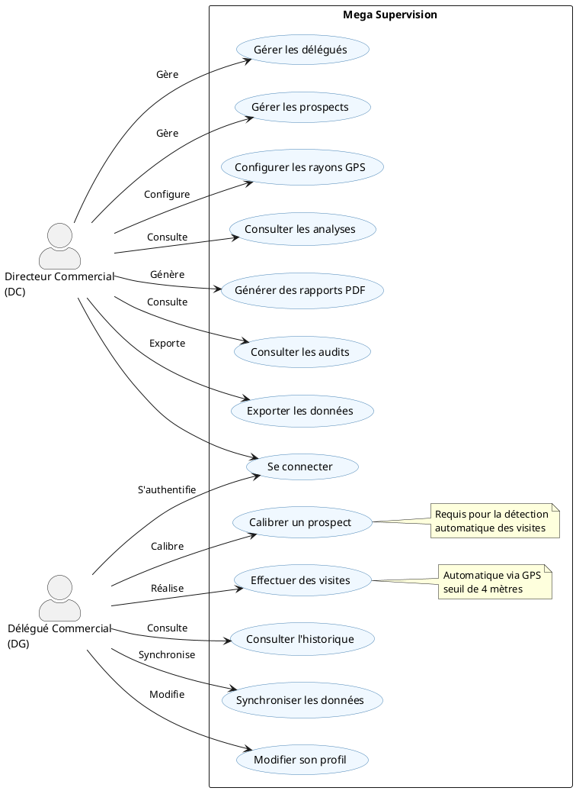
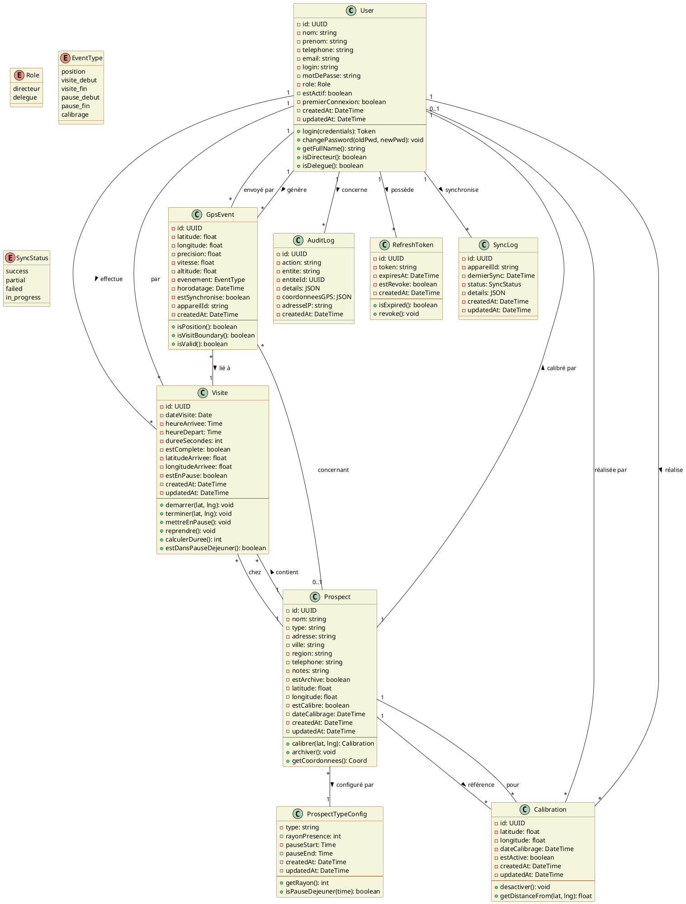
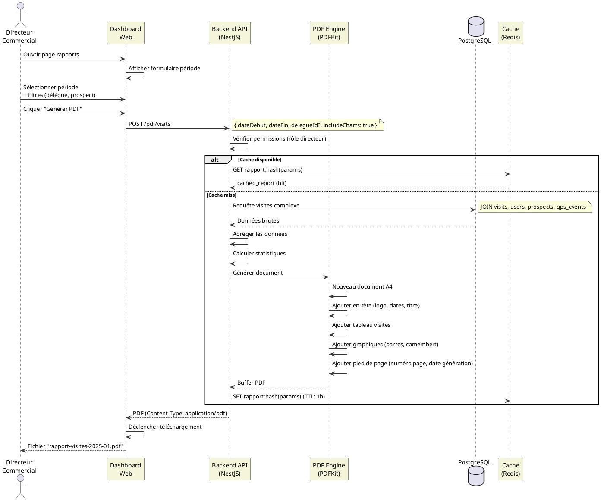
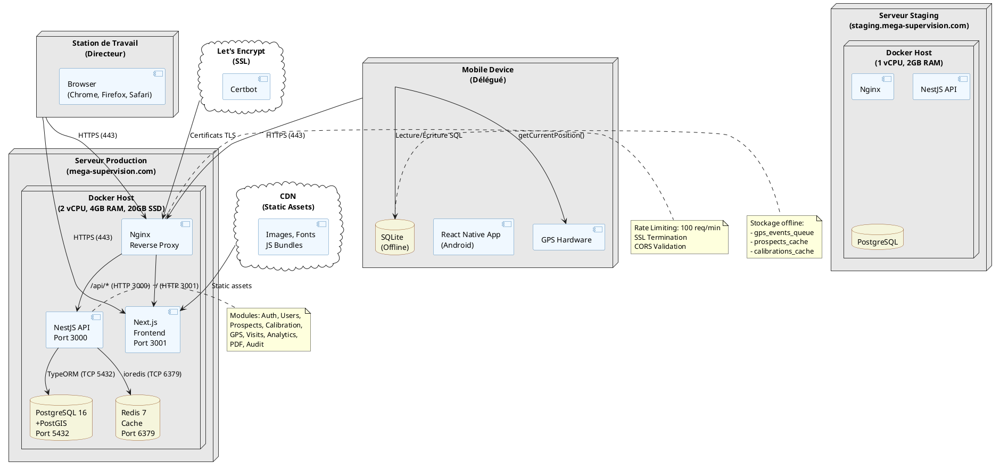
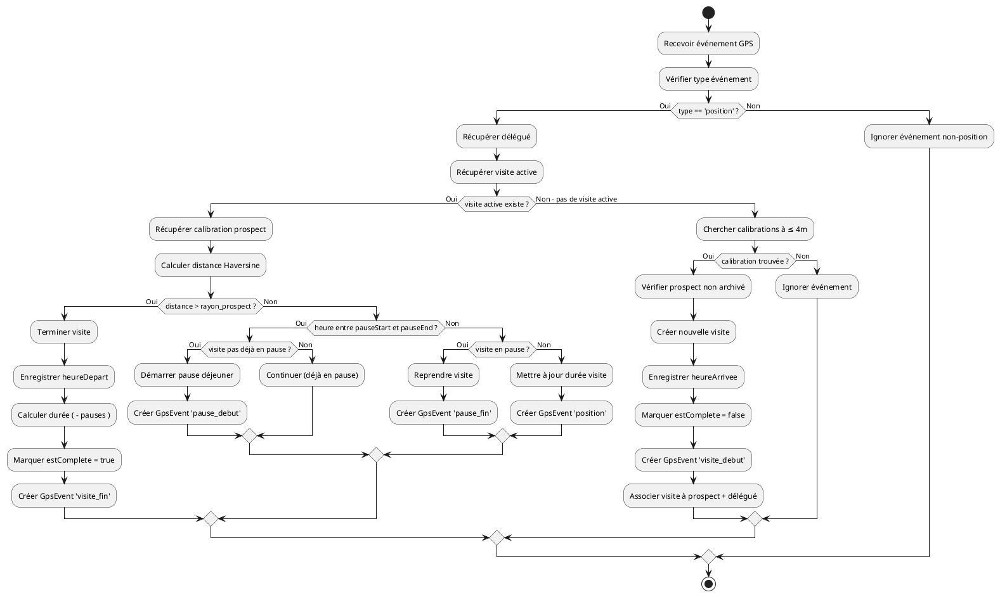
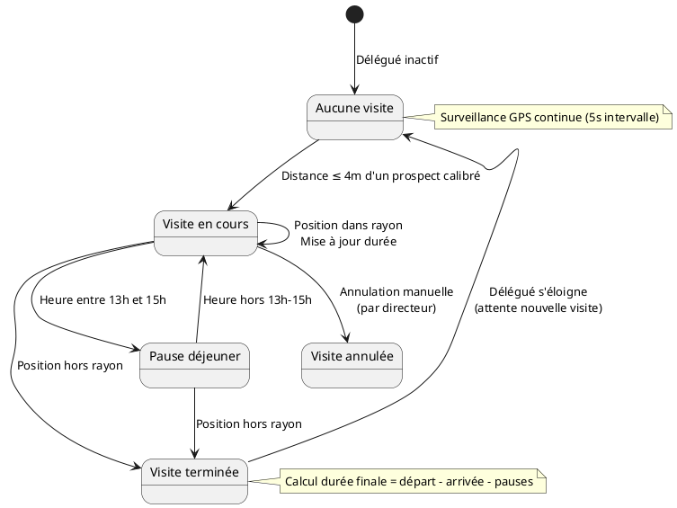
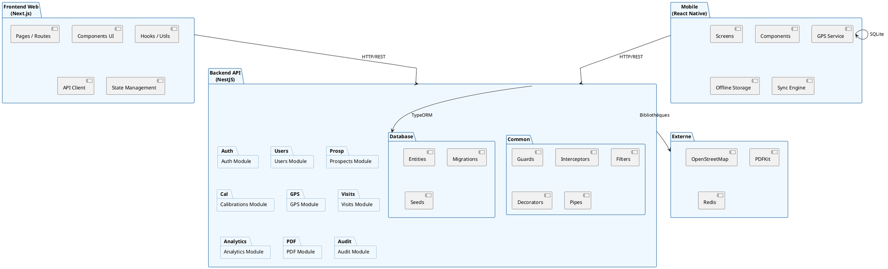

# Diagrammes UML — Mega Supervision

Ce document contient les diagrammes UML complets de l'application Mega Supervision, couvrant les cas d'utilisation, les classes, les séquences et le déploiement.

---

## 1. Diagramme de Cas d'Utilisation

Le diagramme de cas d'utilisation modélise les interactions entre les acteurs (Directeur Commercial, Délégué Commercial) et le système Mega Supervision.

### Description des Cas d'Utilisation

| ID | Cas d'Utilisation | Acteur | Description |
|:---|:-----------------|:-------|:------------|
| UC1 | Gérer les délégués | DC | CRUD des comptes délégués, activation/désactivation |
| UC2 | Gérer les prospects | DC, DG | CRUD des prospects, archivage |
| UC3 | Configurer les rayons GPS | DC | Définir les rayons de présence par type de prospect |
| UC4 | Consulter les analyses | DC | Dashboard, statistiques, tendances |
| UC5 | Générer des rapports PDF | DC | Rapports de visites, fiches prospects |
| UC6 | Consulter les audits | DC | Journal des actions et modifications |
| UC7 | Se connecter | DC, DG | Authentification JWT |
| UC8 | Calibrer un prospect | DG | Capturer la position GPS du prospect |
| UC9 | Effectuer des visites | DG | Visites automatiques déclenchées par la proximité GPS |
| UC10 | Consulter l'historique | DG | Historique des visites personnelles |
| UC11 | Synchroniser les données | DG | Synchronisation hors ligne/online |
| UC12 | Exporter les données | DC | Export CSV/Excel des données |
| UC13 | Modifier son profil | DG | Changer mot de passe, informations personnelles |

---

## 2. Diagramme de Classes

Le diagramme de classes modélise la structure statique du système avec les entités, leurs attributs, méthodes et relations.

### Relations et Cardinalités

| Relation | De | Vers | Cardinalité | Signification |
|:---------|:---|:-----|:------------|:--------------|
| effectue | User | Visite | 1 → ∞ | Un utilisateur peut avoir plusieurs visites |
| réalise | User | Calibration | 1 → ∞ | Un utilisateur peut réaliser plusieurs calibrations |
| génère | User | GpsEvent | 1 → ∞ | Un utilisateur génère de nombreux événements GPS |
| possède | User | RefreshToken | 1 → ∞ | Un utilisateur peut avoir plusieurs refresh tokens actifs |
| synchronise | User | SyncLog | 1 → ∞ | Un utilisateur a plusieurs logs de synchronisation |
| contient | Prospect | Visite | 1 → ∞ | Un prospect peut avoir plusieurs visites |
| référence | Prospect | Calibration | 1 → ∞ | Un prospect peut avoir plusieurs calibrations (1 active) |
| configuré par | Prospect | ProspectTypeConfig | ∞ → 1 | Chaque prospect est d'un type avec sa configuration |
| lié à | GpsEvent | Visite | ∞ → 1 | Un événement GPS peut être lié à une visite |
| calibré par | Prospect | User | 1 → 0..1 | Un prospect est calibré par au plus un utilisateur |

---

## 3. Diagramme de Séquence — Visite Automatique

Ce diagramme illustre le flot complet d'une visite automatique, de l'authentification du délégué à la finalisation de la visite, incluant la gestion de la pause déjeuner et le mode hors ligne.

```plantuml
@startuml
skinparam sequence {
  ArrowColor #333
  ActorBorderColor #4682b4
  LifeLineBorderColor #4682b4
  LifeLineBackgroundColor #f0f8ff
  ParticipantBorderColor #8b4513
  ParticipantBackgroundColor #f5f5dc
}

actor "Délégué\nCommercial" as DG
participant "App Mobile\n(React Native)" as Mobile
participant "GPS Engine\n(Mobile)" as GPS
participant "Backend API\n(NestJS)" as API
participant "Algo Détection\n(Haversine)" as Algo
database "PostgreSQL" as DB
database "SQLite\n(Offline)" as SQLite

== AUTHENTIFICATION ==
DG -> Mobile: Ouvrir application
Mobile -> API: POST /auth/login
note right: { login, motDePasse }
API --> Mobile: { accessToken, refreshToken, utilisateur }
Mobile -> Mobile: Stocker token (SecureStore)

== CHARGEMENT PROSPECTS ==
DG -> Mobile: Naviguer vers liste prospects
Mobile -> API: GET /prospects?estArchive=false
API --> Mobile: Liste des prospects avec statut calibration
Mobile -> Mobile: Afficher liste

== CALIBRAGE PROSPECT ==
DG -> Mobile: Sélectionner prospect\nCliquer "Calibrer"
Mobile -> GPS: getCurrentPosition()
GPS --> Mobile: { latitude: 48.8566, longitude: 2.3522 }
Mobile -> Mobile: Afficher position pour confirmation
DG -> Mobile: Confirmer calibration
Mobile -> API: POST /calibrations
note right: { prospectId, lat, lng }
API -> API: Valider données
API -> Algo: Vérifier cohérence position
API -> DB: INSERT calibration (estActive = true)
API -> DB: UPDATE prospects (estCalibre = true, lat, lng)
API -> DB: INSERT audit_log
API --> Mobile: { id, prospectId, status: "success" }
Mobile -> Mobile: Afficher "Prospect calibré ✓"

== DÉBUT VISITE AUTOMATIQUE ==
DG -> Mobile: Activer tracking GPS
Mobile -> GPS: startBackgroundWatch()
note right: Intervalle: 5 secondes

loop Boucle GPS toutes les 5s
  GPS -> GPS: getCurrentPosition()
  GPS --> Mobile: { lat: 48.8567, lng: 2.3521, precision: 3.2m }

  alt Connexion disponible
    Mobile -> API: POST /gps/event
    note right: { evenement: 'position', lat, lng, precision }
    API -> Algo: haversineDistance(position, calibration)
    Algo -> Algo: distance = 2.5m (<= 4m ? OUI)
    Algo -> Algo: Aucune visite active en cours
    alt Distance <= 4m
      API -> DB: INSERT visits (heureArrivee, dateVisite)
      API -> DB: INSERT gps_events (evenement: 'visite_debut')
      API --> Mobile: { visitDetected: true, visitId, action: 'start' }
      Mobile -> Mobile: Afficher timer de visite
      Mobile -> Mobile: Notification "Visite démarrée"
    else Distance > 4m
      API --> Mobile: { visitDetected: false }
    end
  else Pas de connexion
    Mobile -> SQLite: INSERT gps_events (estSynchronise = false)
    SQLite --> Mobile: Event saved offline
  end
end

== SUIVI VISITE ==
loop Boucle GPS (visite active)
  GPS --> Mobile: Nouvelle position
  Mobile -> API: POST /gps/event (position)
  API -> Algo: distance = 8m (RAYON = 50m, OK)
  API -> API: Vérifier pause déjeuner

  alt 13:00 <= heure <= 15:00
    API -> API: Démarrer pause déjeuner
    API -> DB: INSERT gps_events (evenement: 'pause_debut')
    API --> Mobile: { action: 'pause' }
    Mobile -> Mobile: Pause timer (afficher "Pause déjeuner")
  end

  alt Visiteur sort du rayon
    API -> Algo: distance = 65m > 50m (rayon)
    API -> API: Terminer visite
    API -> DB: UPDATE visits (heureDepart, dureeSecondes, estComplete = true)
    API -> DB: INSERT gps_events (evenement: 'visite_fin')
    API --> Mobile: { action: 'end', duree: 1250 }
    Mobile -> Mobile: Arrêter timer
    Mobile -> Mobile: Afficher résumé visite
    break Fin de la boucle
  end
end

== SYNCHRONISATION HORS LIGNE ==
alt Connexion perdue pendant visite
  Mobile -> SQLite: Accumuler les événements GPS
  loop Attente connexion
    Mobile -> Mobile: Vérifier réseau (NetInfo)
    note right: Backoff: 1s, 2s, 4s, 8s... max 60s
  end
  Mobile -> Mobile: Connexion rétablie
  Mobile -> SQLite: SELECT * WHERE estSynchronise = false
  SQLite --> Mobile: [event1, event2, ...]
  Mobile -> API: POST /gps/sync
  note right: { events: [...], appareilId }
  API -> DB: INSERT gps_events par batch
  API -> API: Exécuter algo détection pour chaque event
  API --> Mobile: { synced: [ids], prospects: [...], calibrations: [...] }
  Mobile -> SQLite: UPDATE estSynchronise = true
  Mobile -> Mobile: Mettre à jour cache prospects
  Mobile -> Mobile: Notification "Synchronisation terminée ✓"
end

== HISTORIQUE ==
DG -> Mobile: Consulter visites du jour
Mobile -> API: GET /visits?date=today
API --> Mobile: [{ prospect, heureArrivee, duree, ... }]
Mobile -> Mobile: Afficher historique avec détails

@enduml
```

---

## 4. Diagramme de Séquence — Génération de Rapport PDF

---

## 5. Diagramme de Déploiement

Le diagramme de déploiement montre la configuration physique des nœuds et des connexions réseau.

### Spécifications des Nœuds

| Nœud | Rôle | Spécifications | Connectivité |
|:-----|:-----|:---------------|:-------------|
| **Serveur Production** | Hébergement principal | 2 vCPU, 4GB RAM, 20GB SSD, Docker | HTTPS (443), SSH (22) |
| **Serveur Staging** | Tests et validation | 1 vCPU, 2GB RAM, 10GB SSD, Docker | HTTPS (443), SSH (22) |
| **Mobile Android** | Application terrain | Android 10+, GPS, Internet | HTTPS, SQLite local |
| **Station Directeur** | Dashboard web | Navigateur moderne | HTTPS |

---

## 6. Diagramme d'Activitié — Processus de Détection de Visite

---

## 7. Diagramme d'États — Cycle de Vie d'une Visite

---

## 8. Diagramme de Paquetages (Packages)

